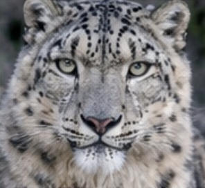
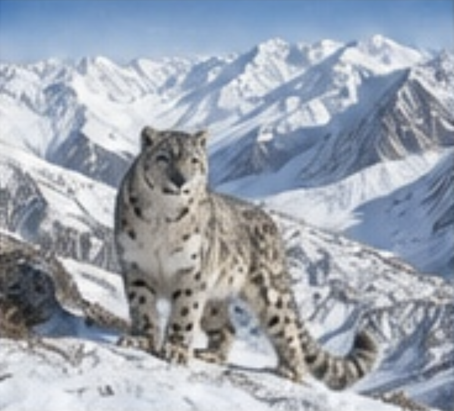

# O‘zbekiston hayvonlari xaritasi — Species Finder

*Surat: Sergey Gorshkov, CC BY 4.0. Foydalanuvchi taqdim etgan hujjatdan olingan.*

## Loyiha haqida

**Species Finder** — O‘zbekistondagi hayvon turlari va ularning hujjatlarda qayd etilgan joylarini interaktiv xaritada ko‘rsatadigan veb loyiha. Birinchi tur sifatida **qor barsi (*Panthera uncia*)** tanlangan. Sayt o‘zbek, rus va ingliz tillarida ishlaydi.

Loyihaning kelajakdagi maqsadi — foydalanuvchi yuklagan suratdagi hayvon turini taxmin qilish, natijani foydalanuvchiga tekshirtirish va tanlangan turning O‘zbekistondagi qayd etilgan joylarini ko‘rsatish.

*Surat: David Shaw, CC BY-NC 4.0. Ushbu suratdan foydalanishda notijorat foydalanish shartiga rioya qiling. Foydalanuvchi taqdim etgan hujjatdan olingan.*

## Hozirgi imkoniyatlar

- Qor barsi haqidagi qisqa ma’lumot va surat.
- O‘zbekiston xaritasida hujjatda keltirilgan beshta joy.
- Joyni tanlaganda xaritani yaqinlashtirish va koordinatalarni ko‘rsatish.
- O‘zbek, rus va ingliz tillari.
- Tur ma’lumotlarini JSON formatida yuklab olish.

## Xaritadagi joylar

| Joy              |    Kenglik |    Uzunlik |
| ---------------- | ---------: | ---------: |
| Hisor            | 38.2950° N | 67.4980° E |
| Chatqol          | 41.4050° N | 70.4190° E |
| Yuqori To‘polang | 38.1730° N | 67.1860° E |
| Zarafshon        | 39.2780° N | 68.3310° E |
| Pskem–Ugam       | 41.5900° N | 70.2500° E |

Koordinatalar `1-tur Qor barsi Panthera.docx` hujjatidan olingan. Ularning aniqligi va kuzatuv sanalari mustaqil tekshirilmagan. Xaritadagi nuqta hayvonning butun yashash hududi chegarasini bildirmaydi.

Hujjatda har bir joydagi qor barslari soni berilmagan. Shu sababli sayt hozir bu joylarni populyatsiya soniga qarab ranglamaydi: ularning soni **noma’lum** deb ko‘rsatiladi.

